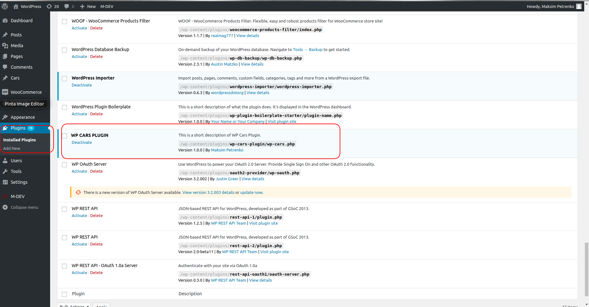
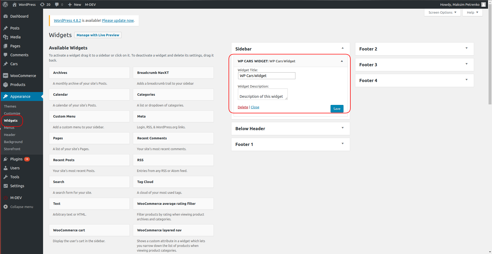
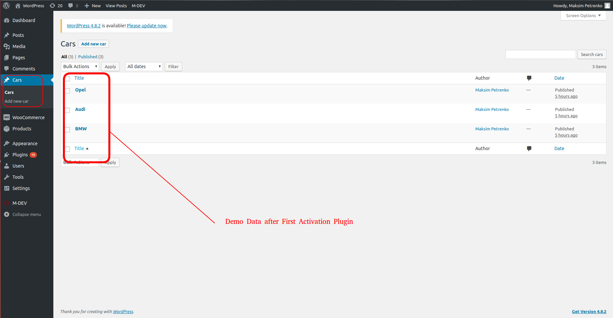
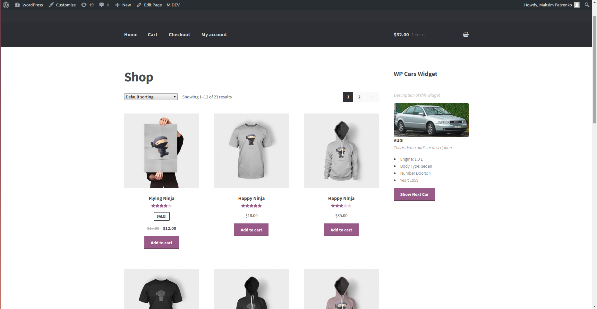

# WP CARS PLUGIN
### Description

Wordpress plugin that register widget to display random cars photo and description.

* Create a custom type of the post "cars"
* This type of post should have the following information:
    * Title (brand and model);
    * Short description;
    * Engine;
    * Body type;
    * Number of doors;
    * Year of manufacture;
    * Photo;
* After your first activation of plugin Demo Content will be automatically insert only once.
* But you can manually create new car custom post in admin or edit exist demo cars;
* The plugin have a widget that will show information about the car.
* When reloading the page, the widget should show information about another car, which was just that.
* In the widget, there are a button "Show Next Car". This button updates the contents of the widget without reload the page to another car, not to the one that was just that.

### Install
* Download `.zip` archive of plugin.

* Upload this `.zip` archive via wordpress admin interface.

* Or unzip archive and upload `wp-cars-plugin` folder to the `/wp-content/plugins/` directory.

* Activate the plugin through the `Plugins` menu in WordPress Admin Area.

* Go to the `Widget` menu in admin area and assign `WP CARS WIDGET` to the any available widget area.

### Screenshots

